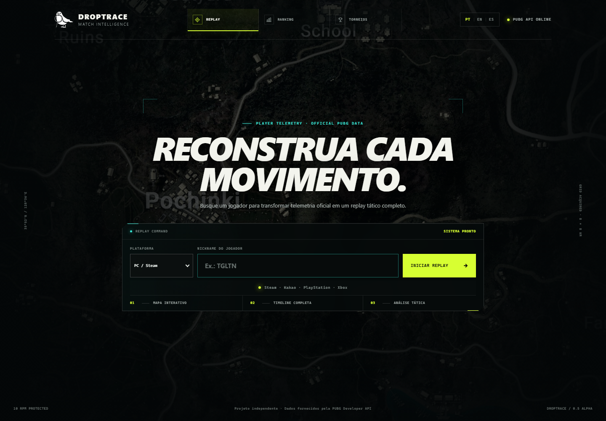
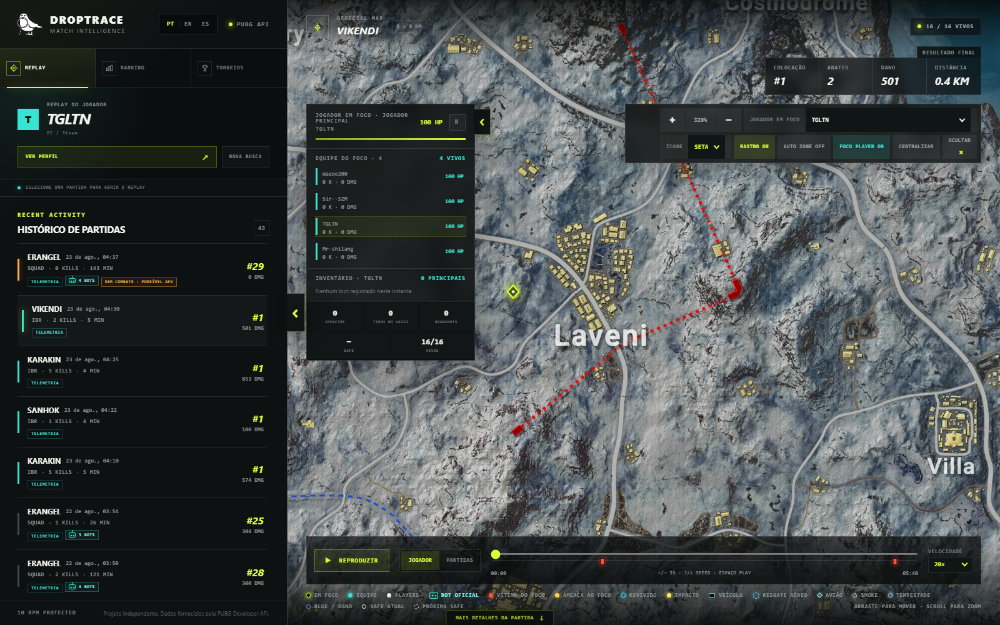

#### DROPTRACE — PUBG Match Intelligence

  <strong>Transforme telemetria oficial do PUBG em replay tático, perfis, rankings e mapas de calor.</strong>

  

## English

DROPTRACE is a PUBG match-analysis web application. Enter a nickname and platform to browse recent matches and reconstruct official telemetry on an interactive tactical map. Visitors do not need a PUBG Developer Portal account or their own API key.

### What you can try

- real-time player search;
- complete history of available matches;
- tactical replay with map, players, zones, events and a navigable timeline;
- player profiles with current-season, ranked, mastery, weapons and match history;
- official leaderboards by platform, region and game mode;
- PUBG Esports tournament calendar;
- drop, elimination and match-ending heatmaps;
- Portuguese, English and Spanish interfaces.

### Data provenance

- **Official:** data returned by the PUBG Developer API and the official PUBG Esports website.
- **Calculated:** replays, routes, timelines, heatmaps and metrics derived from official telemetry.
- **Estimated:** heuristic indicators and processing forecasts, explicitly shown as estimates.
- **Unavailable:** missing information is displayed as `N/A` or unavailable and is never fabricated.

### Source code and security

The application source code and backend are private. This public repository contains only the project presentation and screenshots. The PUBG API key stays in the protected server environment and is never sent to the browser. Shared caching, visitor rate limits and hosting-level abuse protection are enabled.

---

## Português

O DROPTRACE é uma aplicação web de análise de partidas do PUBG. Basta informar o nickname e a plataforma para consultar partidas recentes e reconstruir a telemetria em um mapa interativo. O visitante não precisa criar conta no portal de desenvolvedores nem fornecer uma chave de API.

### O que você pode testar

- pesquisa de jogador em tempo real;
- histórico completo das partidas disponíveis;
- replay tático com mapa, jogadores, zonas, eventos e timeline navegável;
- perfil com temporada atual, ranked, mastery, armas e histórico;
- ranking oficial por plataforma, região e modo;
- calendário de torneios do PUBG Esports;
- mapas de calor de quedas, eliminações e encerramentos de partida;
- interface em português, inglês e espanhol.

### Origem e interpretação dos dados

- **Oficial:** informações entregues pela PUBG Developer API e pelo site oficial do PUBG Esports, como partidas, estatísticas, ranking e telemetria.
- **Calculado:** replay, rotas, timeline, mapas de calor e métricas derivadas da telemetria oficial.
- **Estimado:** indicadores heurísticos e previsões de processamento, sempre apresentados como estimativas e nunca como confirmação de comportamento irregular.
- **Indisponível:** quando a fonte não fornece um dado confiável, a interface exibe `N/A` ou informa que o dado não está disponível; nenhum valor é inventado.

### Código e segurança

O código-fonte da aplicação e o backend são privados. Este repositório público contém somente a apresentação e imagens do projeto. A chave da PUBG permanece no ambiente protegido do servidor e não é enviada ao navegador. O site também aplica cache compartilhado, limites por visitante e proteções da infraestrutura de hospedagem contra abuso.

---

## Aviso legal / Legal notice

Projeto independente, criado para fins educacionais e de portfólio. Não é afiliado, endossado ou patrocinado pela KRAFTON, PUBG Corporation ou PUBG Esports.

PUBG, PLAYERUNKNOWN'S BATTLEGROUNDS e seus respectivos logotipos e marcas são propriedade de seus titulares. Os dados exibidos permanecem sujeitos aos termos e à disponibilidade das fontes oficiais.

Independent educational and portfolio project. Not affiliated with, endorsed by or sponsored by KRAFTON, PUBG Corporation or PUBG Esports. PUBG, PLAYERUNKNOWN'S BATTLEGROUNDS and related trademarks belong to their respective owners.
